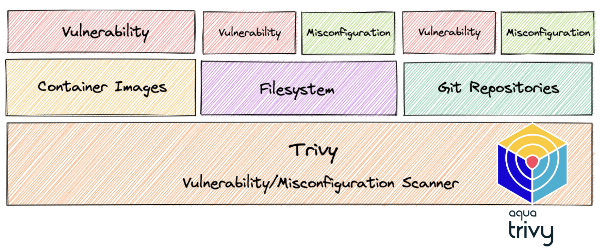

# Scan de vulnérabilités avec Trivy


- Trivy est un scanner de vulnérabilités et de mauvaises configurations pour les containers et d’autres artefacts.  

- Il permet de détecter des vulnérabilité sur les packages OS (Alpine, RHEL, etc.) et ceux spécifiques à des langages (Bundler, composer, yarn). 

- En outre, Trivy scans les fichiers IAC comme Terraform et Kubernetes pour détecter de potentiels problèmes de configuration pouvant exposer les déploiements à des risques d’attaques





Chaque vulnérabilité détecter dispose d’un CVE ID et d’un niveau de sévérité.

**Common Vulnerabilities and Exposures (CVE)** : base de données des problèmes de sécurité de l'information divulgués publiquement. 
**Vulnérabilité** : faiblesse qui peut être exploitée pour obtenir un accès non autorisé ou effectuer des actions non autorisées sur un système informatique
**Exposure** : erreur qui permet à un attaquant d'accéder à un système ou à un réseau.


NB: Avant de poursuivre ce lab, assurez-vous d'avoir effectuer les labs précédents.


#### Vérification de l'existence de l'image flaskapp

```
docker images --filter "reference=flaskapp"
```

#### Scan vulnérabilités 

```
docker run -v /var/run/docker.sock:/var/run/docker.sock aquasec/trivy image flaskapp
```

#### Filtrage des vulnérabilités Severe & Critique

```
docker run -v /var/run/docker.sock:/var/run/docker.sock aquasec/trivy image --severity=HIGH,CRITICAL flaskapp
```

#### Scan d'un repository

```
docker run -v /var/run/docker.sock:/var/run/docker.sock aquasec/trivy repo https://github.com/K6SY/lecloudfacile-k8s-bootcamp.git
```


Pour plus de détails, consultez le [site officiel](https://aquasecurity.github.io/)
